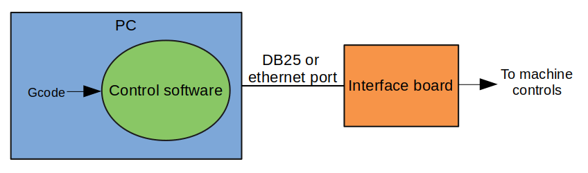
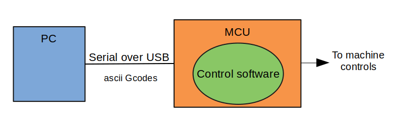
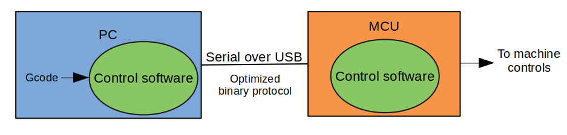

Introduction
============

The last decade has seen an explosion of the open source community around 3D
printing. Many great softwares have emerged, that are simpler, faster and
cheaper to use. I found one of them particularly promising and decided to adapt
it for plasma cutting. This was Klipper and we will see why it is so special.

`Klipper for plasma`_ is a modified version of the 3D printing controller
`Klipper`_. Therefore, before starting I want to say a big thank-you to Kevin
O'Connor in particular and all contributors of Klipper for this brilliant work.

Architecture
------------
As opposed to most controllers, Klipper has a distributed architecture. The high
level logic stands on a PC, while the real-time stuff is handled by a
microcontroller board (MCU). By doing this, it combines benefits of both PC-only
and MCU-only architectures.

PC only architecture
********************
LinuxCNC and Mach3 for example are PC-only, meaning their operating systems
(Linux and Windows) use a real-time kernel. This is a powerful, but complex
solution. Handling real-time internally also implies to use real-time capable
ports to control the machine. This is the reason why they use parallel ports or
sometimes ethernet, instead of USB which is not compatible by design. With 3D
printers having paved the way for simpler machine control, I now believe that
relying on a specialized operating system should be reserved to very complex
machines.

MCU only architecture
*********************
On the other side, there exist MCU-only architectures like Marlin or Grbl. They
rely solely on the MCU. They works fine in most cases, but can struggle to run
smoothly on slower boards (8 bits AVR) when adding features like THC. It was the
case for `Plasmarlin`_, a fork of Marlin I previously made for plasma. Moreover,
these implementations generally use plain ASCII to receive Gcodes and respond.
Which is not particularly convenient when having to stream high frequency data
to monitor THC for example.

Hybrid architecture (Klipper)
*****************************
For its part, Klipper combines the PC's performances and the simplicity of MCUs.
It can be compared to a PC sound card. The PC sends sounds to be played soon,
without concern for timing. Then, the sound card is in charge to play it when
perfect time has come, without knowledge of the complete song.

This way, there is no more need for real-time OS and particular ports, just USB.
In addition, all complex calculations are done on the PC, meaning even a good
old Arduino Mega can achieve great performances. Also, Gcodes are parsed on the
PC side, leaving the field open for an optimized protocol over serial, which
gives enough bandwidth for THC monitoring. And by the way it is a free and open
source.

Features
--------

In addition to the original Klipper features, the following have been to handle
plasma cutting.

Basic torch controls :
    - Plasma start
    - Plasma stop
    - Wait for arc transfer
    - Arc loss detection once running

THC (Torch Height Controller) :
    - Full speed THC with acceleration ramps (no babystepping)
    - Virtual Z limits for THC
    - Minimum feedrate threshold to pause THC and prevent torch to dive during slowdowns

Future
******
Dynamic control of current and pressure for compatible Hypertherm cutters
(Powermax 45XP/65/85/105/125) through RS485 extension board.
Controlling the current on the fly allows to keep a constant kerf width when
slowing down in corners. It is generally reserved for industrial machines, thus
it is a kind of Graal for THC.

.. _Klipper for plasma: https://github.com/proto3/klipper-plasma
.. _Plasmarlin: https://github.com/proto3/plasmarlin
.. _Klipper: https://www.klipper3d.org/
